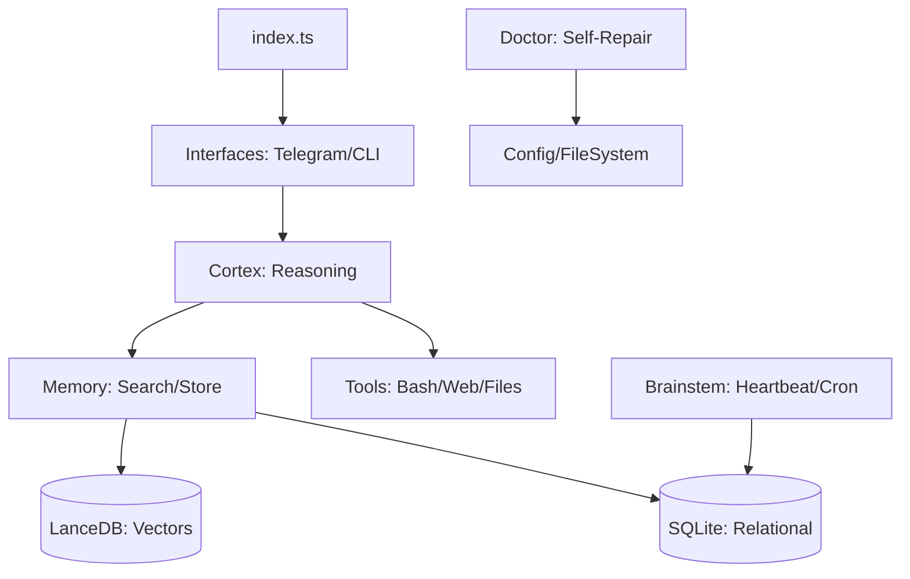

# 🧠 Arquitetura do Sistema Pegasus

Este documento detalha os princípios de engenharia e os fluxos de dados que compõem o sistema Pegasus.

## 1. O Loop de Raciocínio (Cortex)

O Pegasus não responde de forma linear. Ele utiliza um processo cíclico de 5 estágios chamado **Cortex Pipeline**:

### 🔍 SEARCH (Busca Contextual)
Antes de qualquer processamento, o Pegasus analisa a mensagem do usuário e realiza uma busca híbrida:
*   **Similaridade Vetorial**: Busca conceitos relacionados no LanceDB.
*   **Knowledge Graph**: Recupera entidades e relações (ex: "Quem é X?", "Qual a relação entre Y e Z?").
*   **FTS (Full Text Search)**: Busca por palavras-chave exatas.

### 💭 THINK (Raciocínio Forçado)
O agente utiliza a técnica de **Chain-of-Thought (CoT)**. Ele é instruído a gerar um bloco `<thinking>` interno onde:
*   Analisa a intenção do usuário.
*   Verifica se precisa de ferramentas externas.
*   Planeja a execução passo a passo.
*   *Nota: Este conteúdo é logado para depuração, mas omitido na interface final do usuário.*

### 🛠️ ACT (Execução de Ferramentas)
Se o pensamento indicar a necessidade, o Pegasus invoca ferramentas (Tools). Ele suporta execução multi-etapa, onde o resultado de uma ferramenta pode alimentar a próxima.

### 💾 REMEMBER (Consolidação)
Após gerar a resposta, o processo de **Auto-Extração** entra em ação:
*   O LLM analisa a interação e extrai novos fatos, entidades ou preferências.
*   Esses dados são imediatamente indexados na memória de longo prazo.

### 💬 RESPOND (Entrega)
A resposta final é formatada (Markdown) e entregue através da interface ativa (Telegram ou CLI).

---

## 2. Hierarquia de Modelos (Router)

O Pegasus utiliza um sistema de **Routing Inteligente** para otimizar custo e performance:

1.  **Fast Model (Ollama/Gemini Flash)**: Usado para tarefas simples, resumos rápidos e extração de memória.
2.  **Smart Model (NVIDIA Llama 3.1 70B/Claude 3.5)**: Usado para o raciocínio central, codificação e tomada de decisão complexa.
3.  **Vision/Image Model (HuggingFace/Flux)**: Invocado especificamente para tarefas de mídia.

---

## 3. Autonomia e Funções Vitais (Brainstem)

Diferente de scripts comuns, o Pegasus possui um "sistema nervoso autônomo":

*   **Heartbeat**: Um processo que roda a cada 5 minutos garantindo que os bancos de dados estão saudáveis e registrando o uptime.
*   **Cron System**: Permite que o agente agende suas próprias tarefas (ex: "Verifique o status do servidor X todas as manhãs").
*   **Ciclo de Sonho (Dreaming)**: Um processo de manutenção pesada que ocorre em horários de baixa atividade para realizar manutenção da base de dados vetorial.

---

## 4. Estrutura de Diretórios e Fluxo de Arquivos

---
> [!NOTE]
> Toda a comunicação entre módulos é tipada rigorosamente com TypeScript para evitar falhas em tempo de execução.
